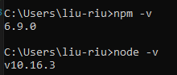
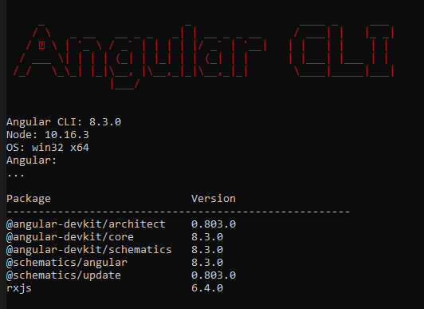

# CaresPWA Project

This is the CaresPWA project for Cares 2, using Angular, Ionic, PWA.

[TOC]

## Style Guide

For the purpose of creating a easy-to-maintain, easy-to-understand, easy-to-locate, high performed application, this project has taken the following rules as main consideration, please follow:

* LIFT
  * L(**L**ocate your code quickly)
  * I(**I**dentify the code at the glance)
  * F(Keep **F**latest structure, no deep nested folders)
  * T(**T**ry to be dry)
* Naming Convention
  * Use **feature-based naming** to structure the top level and below. Use **convention-based naming** for the lower level **if needed**
  > Note: feature-based naming: provider, person, inspection etc.
  > convention-based naming: page, component, services etc.
  * Use **Angular CLI** to generate all the files that is part of Angular. Every files that is part of the angular building block, like a component, a module, a pipe and so on, **must follow the same naming convension**, which should be auto generated from Angular CLI: **[name].[structure].[file-extension]**
  * The name of the **feature** should represent several things:
    * The **URL that is used to refer this feature**, like 'questionnaire' feature should be able to reference as '[Root]/questionnaire' from the URL.
    * The **prefix of the child components**, like the child components under 'intent' module are named as 'intent-provider', 'intent-people' and so on.
  * The name of the **component** should represent several things:
    * The **URL that is used to refer this component** if available, like 'intent-people' should be referenced in '[Root]/Intent/people'
    * The **Title/Header of the page** if it is the main content of the page, like the 'People' page is using 'intent-people' component and the title of the page is 'People'
  * For typescript coding convention, follow the [style guide for typescript]("https://basarat.gitbooks.io/typescript/docs/styleguide/styleguide.html"), including when to use camelcase and pascalcase and so on.
* **Container & Presentation Pattern**: The Container should be responsible for getting the data and routing, the presenationer should be responsible for presenting the data: [Example One]("https://blog.angularindepth.com/container-components-with-angular-11e4200f8df"), [Example Two]("https://blog.angular-university.io/angular-component-design-how-to-avoid-custom-event-bubbling-and-extraneous-properties-in-the-local-component-tree/").
* All the components, except for 'feature component', should take **loose coupling** in mind, which will make the component more reusable and maintainable.

## Technology

For this project, the following technologies are used to create and maintain application. Some of them are libraries, some of them are code patterns or concepts. Get to know of these terms will help to understand and design the application better.

* __Angular__: The main framework of the application
* __Angular CLI__: The command line interface of angular to create standardized files for components, modules, services and so on
* __Ionic__: The UI libraries that is used in the application
* __Ionic CLI__: Used to generate the Ionic template, such as tab, menu and so on.
* __Reactive Form__: The main format of the form that is used.
* __OIDC_Client__(OpenID & OAuth): A library that is used along with OpenID and OAuth protocol.
* __NgRx__: The state management library that is used in the application.
* __Compodoc__: The third party tool to generate the documentation of the application.
* __Presentation and Container Pattern__: This is a pattern for structuring the nested components with data flow.
* __Markdown__: The document language we are going to use for the application.

## Story Planning

Here is a list of items that the developer needs to consider when analysis and esitmate the hours for the work item:

1. create the model/interface for the page
2. html page design
3. page funcitonality with interactions
4. mobile style for the page
5. make the page responsive
6. validation for the page
7. create services for the page
8. create state management for the page including states, actions, reducer, effects.
9. additional style check
10. hookup with APIs
11. routing for the component
12. testing overall

## Installation

In order to setup the best development environment, there are several tools and libraries that are essential to be installed. Here is a list of them:

Here is the list of software that you need to install before start the project:

* node.js
* npm
* Angular CLI
* ionic
* Compodoc (optional)
* Augury (optional)

#### 1. Install **node.js** && **npm**

[Link to download Node.js](https://nodejs.org/en/)
> Note: NPM directly come with node.js, to check whether they are installed correctly or not, open cmd prompt and type `node -v` and  `npm -v`, the result should show the version if they are correctly installed.
>
> 

### 2. Install **Angular CLI**

Open the command prompt/node command prompt type `npm install -g @angular/cli`

>Note: Same here if you want to check ionic is successfully installed, type `ng v` in the cmd prompt.
>

### 3. Install **ionic**

After you install **node.js** and **npm**, just open the command prompt/node command prompt type `npm install -g ionic`

>Note: Same here if you want to check ionic is successfully installed, type `ionic -v` in the cmd prompt.

### 4. Install **IIS Express Extension in Visual Studio Code**

Search "IIS Express" in the "Extension" tab in VSCode and it is the only availiable option. Install it and for more information, check this link: [IIS Express]("https://marketplace.visualstudio.com/items?itemName=warren-buckley.iis-express")
> Note: Remember to config the 'iisexpress.json' to set up the correct folder. The location of the file is `{ProjectDirectory}/.vscode/iisexpress.json`, and the set up should be something like this: 
> `{
  "port": 8100,
  "path": "C:\\Users\\{user}\\Source\\Workspaces2019\\CARES\\Cares2\\CaresPWA\\CaresPWA\\www",
  "clr": "v4.0",
  "protocol": "http"
}`

### 5. Install **Ionic 4 Snippets**

Install "Ionic 4 Snippets" in VSCode, search the keyword "Ionic 4 Snippets" in VSCode Extension tab and intall the extension.
[Link to install Ionic 4 snippets](https://marketplace.visualstudio.com/items?itemName=fivethree.vscode-ionic-snippets)

### 6. Install **Compodoc**

Open the command prompt/node command prompt type `npm install -g @compodoc/compodoc`

Run
> npm run compodoc

>Note: This is an angular documentation tool to give a clean interface of the project structure without manual work

### 7. Install **Augury**

[Link to install Augury](https://chrome.google.com/webstore/detail/augury/elgalmkoelokbchhkhacckoklkejnhcd)

>Note: This is a chrome extension to help on a better angular debugging experience.

### 8. Install **Redux DevTools**

[Link to install Redux DevTools](https://chrome.google.com/webstore/detail/redux-devtools/lmhkpmbekcpmknklioeibfkpmmfibljd?utm_source=chrome-ntp-icon)

>Note: This is a chrome extension to help on a better redux debugging experience.

### 9. Install **Angular Language Service**

Install "Angular Language Services" in VSCode, search the keyword "Angular Language Service" in VSCode Extension tab and intall the extension.
[Link to install Angular Language Service](https://marketplace.visualstudio.com/items?itemName=Angular.ng-template)

### 10. Install **Angular 8 Snippets & Angular Snippets (Version 8)**

Install either or both snippets in VSCode, Angular 8 Snippets is created by Mikael Morlund and Angular Snippets(Version 8) is created by John Papa.
[Link to install Angular 8 Snippets](https://marketplace.visualstudio.com/items?itemName=Mikael.Angular-BeastCode)
[Link to install  Angular Snippets (Version 8)](https://marketplace.visualstudio.com/items?itemName=johnpapa.Angular2)

### 11. Install **TSLint**

Install TSLint in VScode to maintain a good standard of typescript coding pattern.
>Note: Installing the old version since it is more stable although it has (deprecated) label on the title. Some comments are mentioning bugs for the latest version.

[Link to install TSLint](https://marketplace.visualstudio.com/items?itemName=eg2.tslint)
